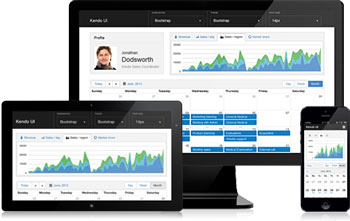
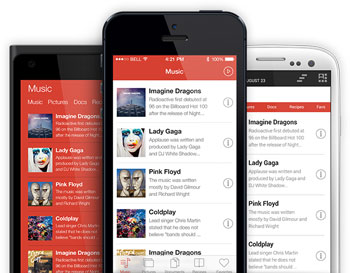
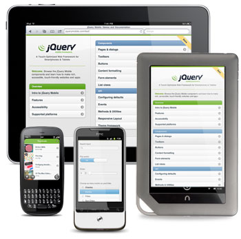
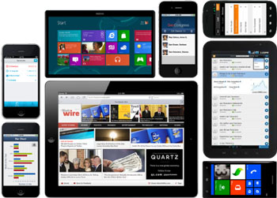

Qu'on choisisse de développer une application mobile avec phonegap, trigger.io ou un site mobile "Single Page Application" , on ne le développe pas de la même façon qu'un site internet classique, le site ou application doit ressembler à une application native.

Ressembler à une application native ça veut dire : s'adapter sur smartphones et tablettes, avec la possibilité d'avoir un layout différent selon l'appareil, être constitué de plusieurs pages qui prennent tout l'espace disponible sur l'écran, des transitions avec accélération hardware, des side menus à la Facebook, des longues liste scrollables avec de bonnes performances, de l'inertie et un effet de rebond à la fin, du pull-to-refresh façon twitter, des boutons et des sliders assez gros pour pouvoir être utilisé sur un smartphone, etc.

Après avoir choisi son framework de base qui gèrera toute la logique et la structure de l'application (backbone, ember, angular), il convient donc de choisir un framework UI, qui s'occupera de la partie graphique de l'application. Et là, le choix et vaste. Voici une petite sélection des principaux candidats.

 

### Kendo UI

Surement une des solutions les plus abouties, présente depuis 2011, développé par Telerik, s'adapte bien sur tablette et smartphone, de puissant outils de visualisation de données et de création de graphiques, de nombreux widgets. Kendo dispose même de wrappers pour languages serveur comme ce [module](http://demos.kendoui.com/web/autocomplete/index.html) de recherche avec autocompletion en php. La documentation est très bien faite. Ca serai surement le framework à conseiller sans hésiter si ce n'était pour la licence, à partir de 199$ pour Kendo UI Mobile.

[kendoui.com](http://www.kendoui.com/)

### ChocolateChip-UI

ChocolateChip est focusé sur la rapidité de chargement et de rendu, en ne prenant pas en compte les vieux navigateurs, son objectif à été dès le début  d'être plus rapide et plus léger que jQuery. iOS, Android et Windows phone sont pris en charge, la dernière version intègre un thème iOS 7 "flat". Tout les éléments graphiques sont en SVG comme ça pas de problème pour les différentes résolutions d'écrans et même les écrans rétina. La librairie est présente depuis 2010 et est disponible sous license open source à la simple condition de mentionner son utilisation dans l'application. Un très bon choix pour une application qui se doit d'être, tant que possible aussi réactive qu'une application native.

[chocolatechip-ui.com](http://chocolatechip-ui.com/)

### jQuery Mobile

Le framework le plus facile d'accès, avec une très bonne documentation et une énorme communauté. Supporte de nombreux naviguateurs. Il n'est par contre pas réputé le plus "snappy". A conseiller à un débutant ou pour un site mobile à développer rapidement qui ne nécessite pas de performances "native-like". La licence est la mêm que pour jQuery, MIT, Free for commercial use.

[Demo](http://view.jquerymobile.com/1.3.2/dist/demos/examples/) 

### Ionic

Ionic est conçu pour fonctionner seulement pour les applications hybride et les derniers navigateurs mobile (Android 4.2 & iOS 6 minimum). Licence MIT.

[Demo](http://ionicframework.com/docs/components)

 

### Sencha Touch

Réputé un peu plus compliqué à prendre en main, il peux vite devenir un outil très efficace avec un peu d'expérience, et permet de développer des applications hybride très rapidement. Il est aussi connu pour être celui qui à le rendu le plus rapide et une bonne gestion de la mémoire.  La licence est gratuite même pour utilisation commerciale.

[Demo](http://dev.sencha.com/deploy/touch/examples/production/kitchensink/)

 

 

 

 

 

### Junior

[junior-mobile-framework](./junior-mobile-framework.jpg)

[Demo](http://justspamjustin.github.io/junior)

 

### Lungo

[lungo-mobile-framework](./lungo-mobile-framework.jpg)

[Demo](http://lungo.tapquo.com/)

 

### Fries

[fries-framework](./fries-framework.jpg)

[Demo](http://jaunesarmiento.me/fries/)

 

Et pour vous aider à faire un choix, voici [un site](http://propertycross.com/) qui regroupe des screenshots de la même application réalisée avec différents frameworks et un [tableau comparatif](http://www.markus-falk.com/mobile-frameworks-comparison-chart/) bien pratique
