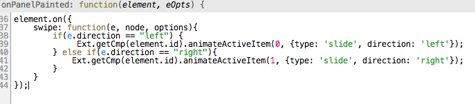

```javascript
element.on({
     swipe: function(e, node, options){
         if(e.direction == "left") {
              console.log('swipe left');
         } else if(e.direction == "right"){
              console.log('swipe right');
         }
     }
 });
```

Et avec Sencha Architect, il faudra utiliser au préalable l'évènement onPanelPainted :

[](/posts/wp-content/uploads/2013/12/Screen-Shot-2013-12-18-at-12.38.56.png)
