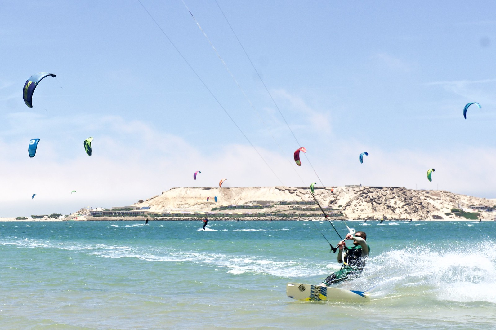
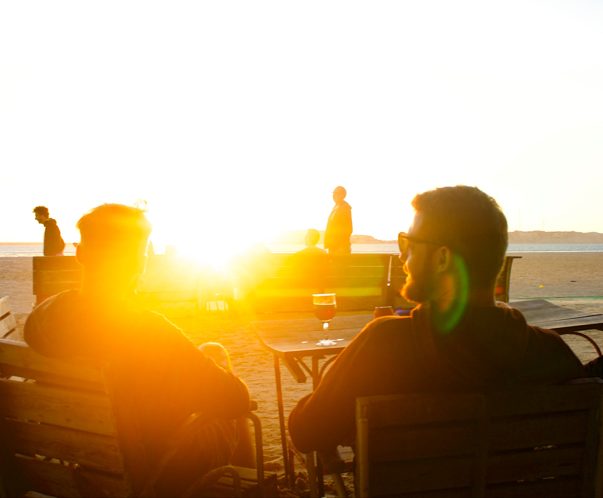
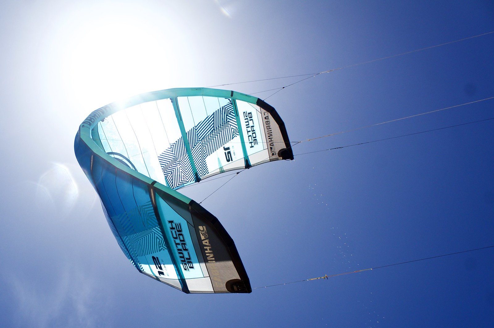
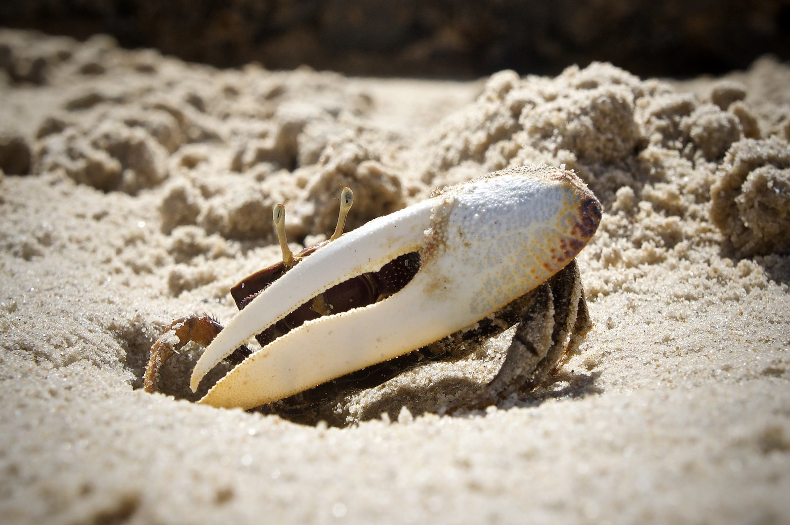
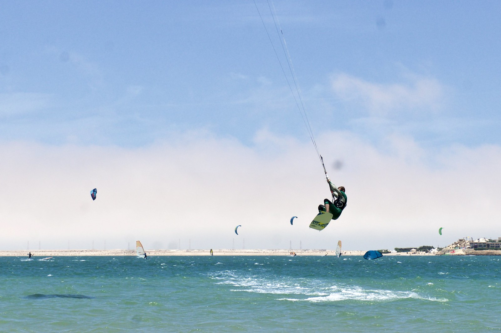
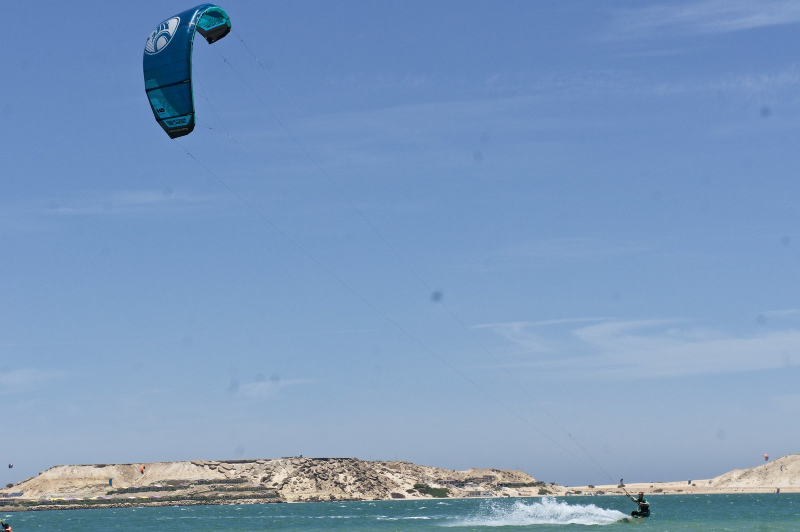
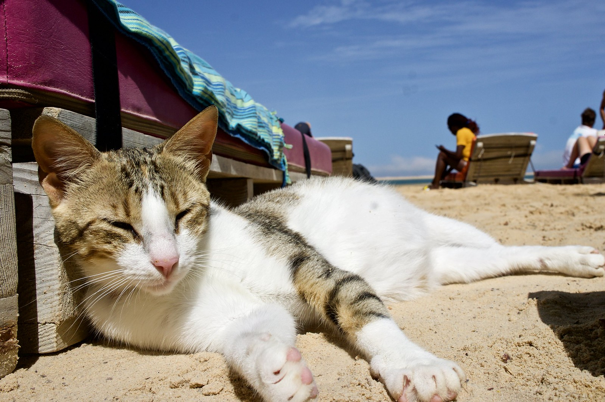
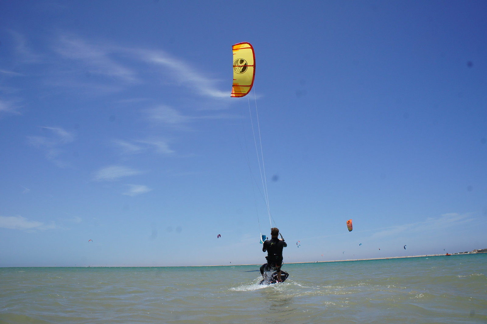
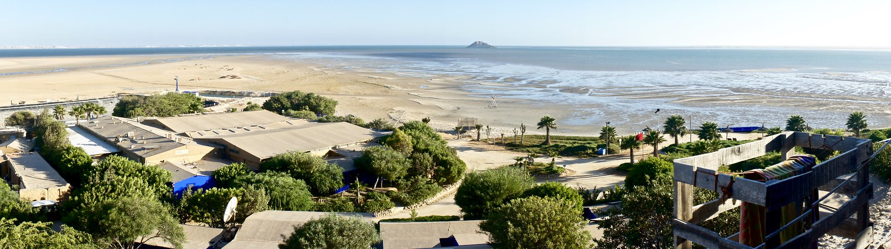
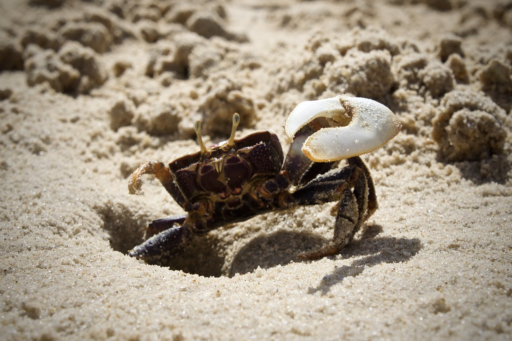

Dakhla is the most relaxing place I know. Lots of sport, excellent food, not much to do except kitesurf, cozy accomodations, slow/no  internet, frappuccinos at the beach bar between two rides and a beer at sunset in the evening.

Every day is wind day in Dakhla, it is as if a giant fan was switched on all year long. A great place to learn and practice kiteboarding.

