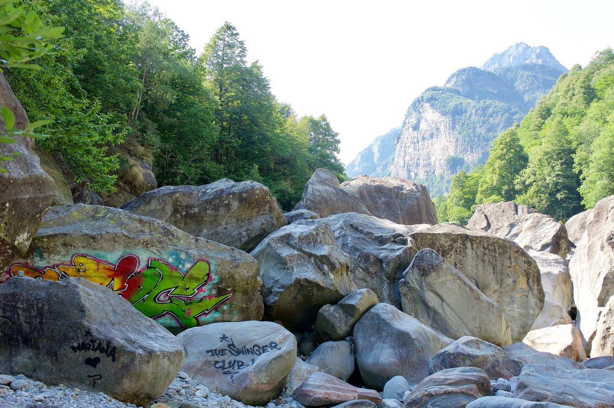
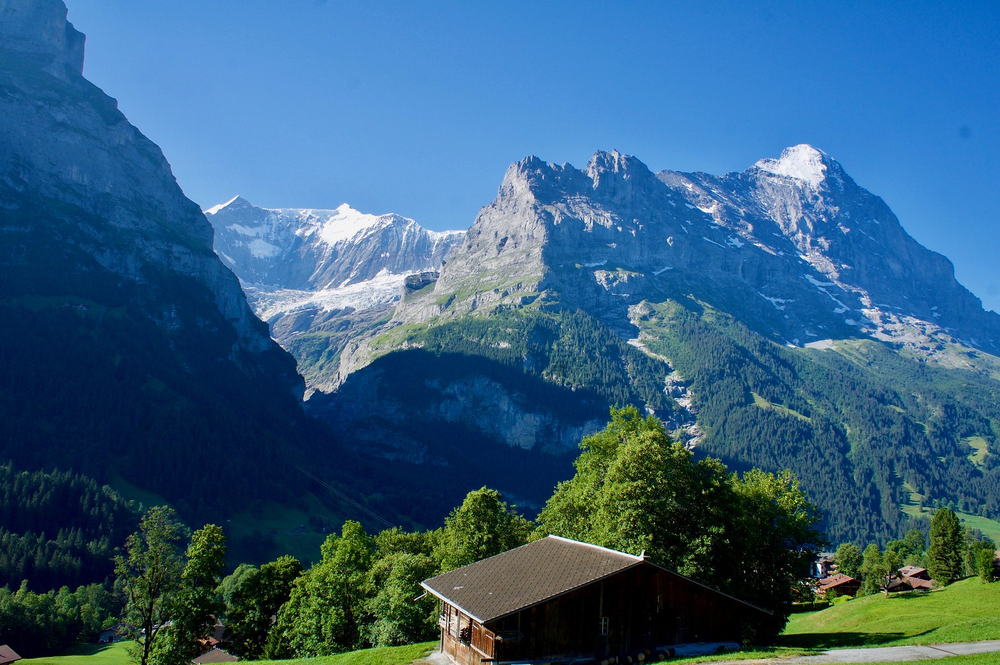
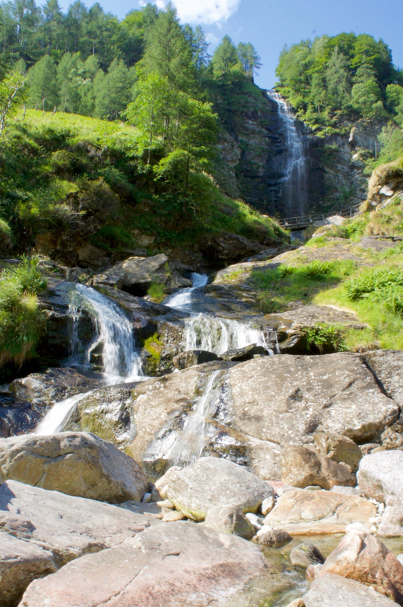
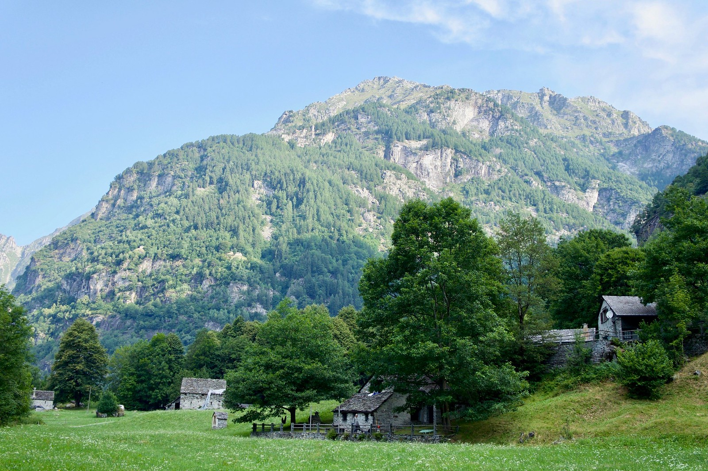
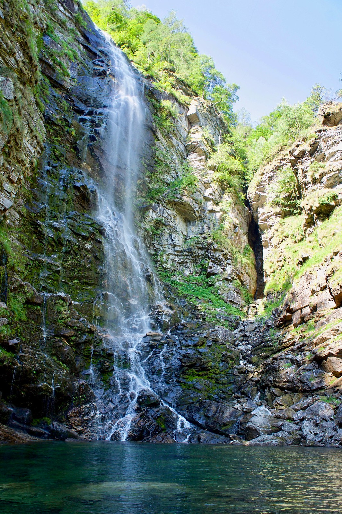

A one week road trip to the Italian part of Switzerland via Interlaken and the Great St Bernard Pass 

Cascate Della Froda. Froda waterfall. In valle verzasca.

View of the Eiger (3967 m) from Grindelwald

