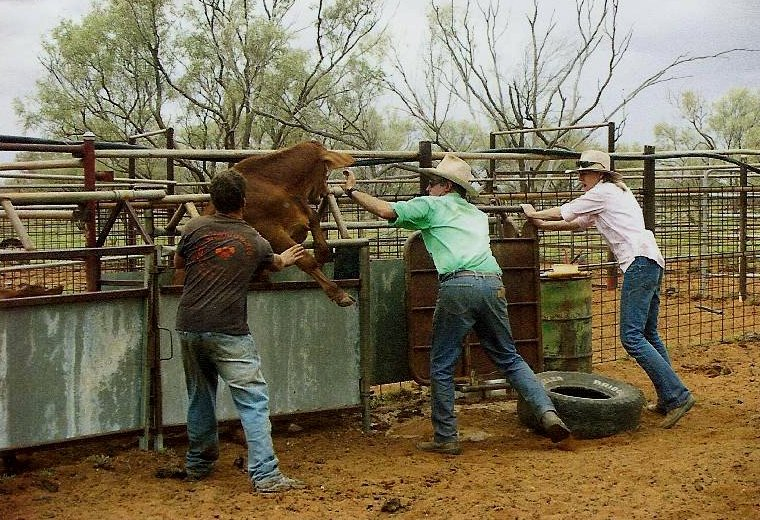
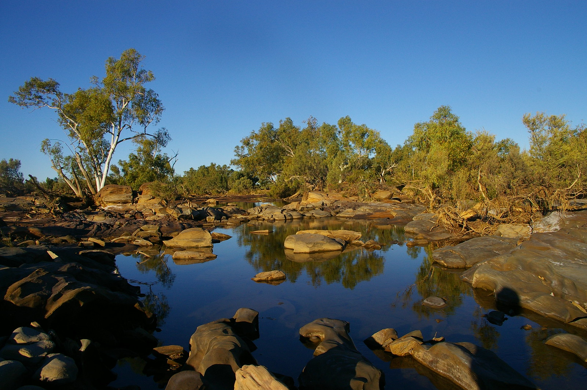

In 2008 I went to Australia for a gap year with a Working Holiday Visa. Australia is huge, it is disconcerting when not used to. I discovered people living lives I didn't kown could still be lived.

People in the Australian bush are pretty handy. They always find a way to build with what they have at hands. they find workarounds, since any shopping would take at least a day. They have their own airplanes, choppers, gas stations, landfill dumps, shool at home.

They taught me how to ride a horse, muster cattle, weld yards, build concrete throughs, service bulldozers, take care of the animals, and much more.

A weekend at the Einasleigh rodeo.

This is a goanna, a species of monitor lizard found in Australia from beaches to the bush. This one is about 1,5m long.

Tilly, a crazy dog with too much energy.

A young male trying to escape.

Preparing the horses before a day of cattle mustering at Flat Creek station.

We went for a weekend at the Wandagee Bush Gymkhana. A neighbour gathering where people came flying in, with their own personal chopper. Here a two seater piston engine Robinson R22. The green thing next to the helicopter skids is a swag, kind of like a sleeping bag but with an integrated mattress.

A car at Wandagee station. It is named 'Red back' after the infamous Australian spider. This car is hardended with steel bars because it is used to catch cattle or camels, with old tyres on each sides so as no to hurt them.

Here's the result after a day of mustering with horses and helicopters. I think we found most of them and are bringing them back to the yards.

Once in the yards we check, mark and treat the cows. And cut the horns and balls of some of the young males (weaners).

