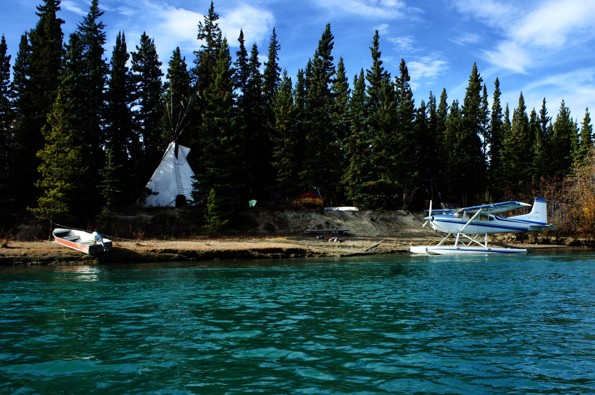
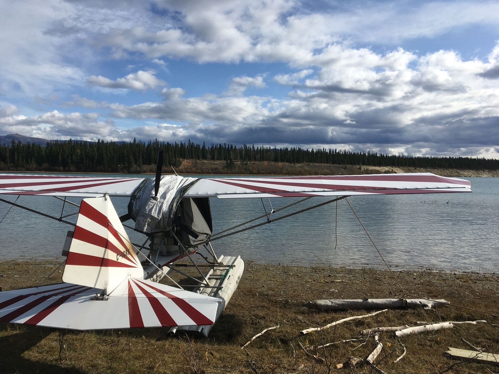
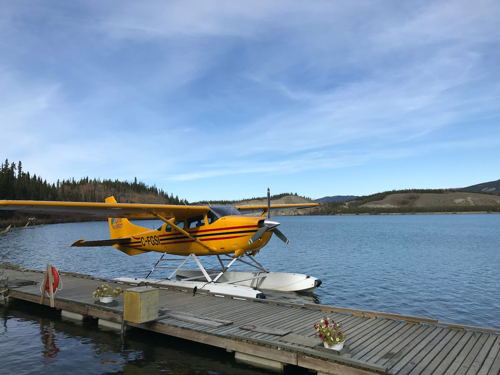
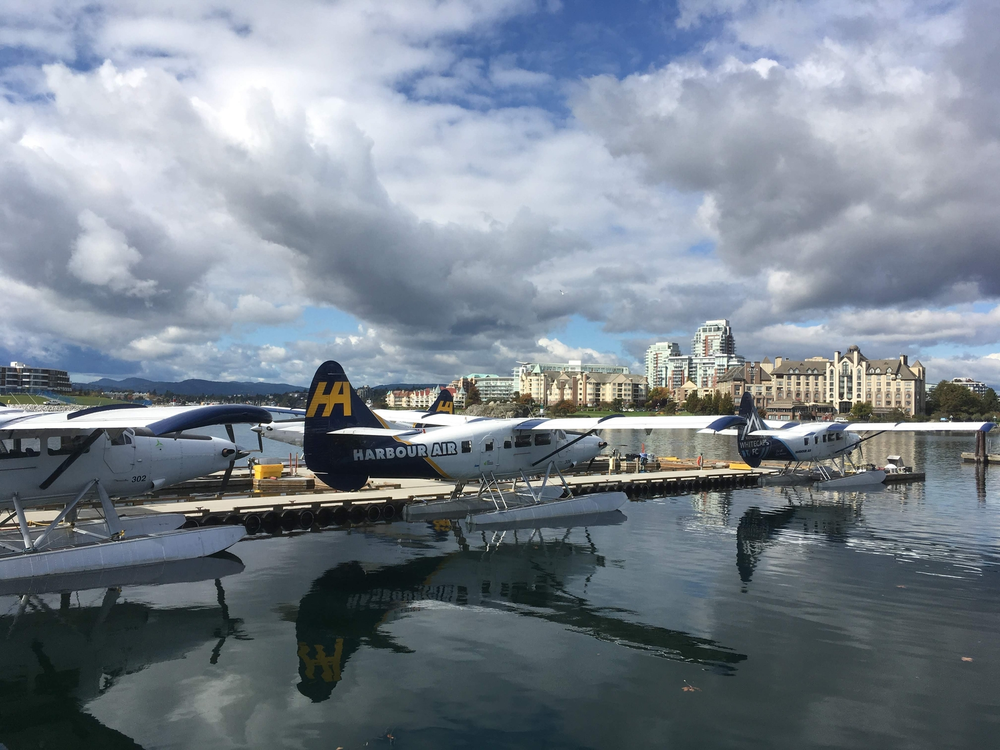
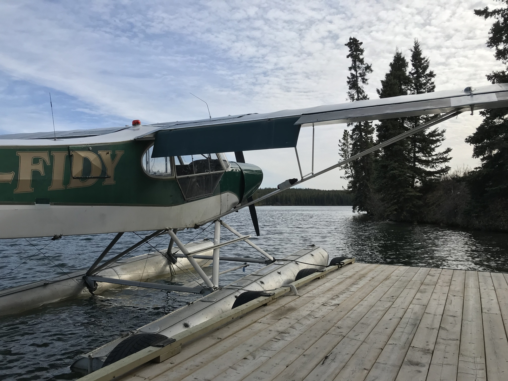
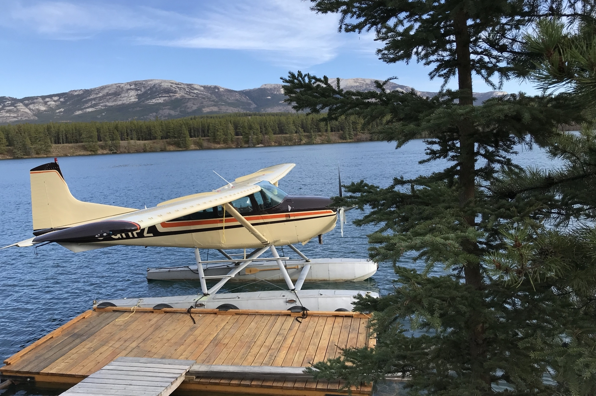
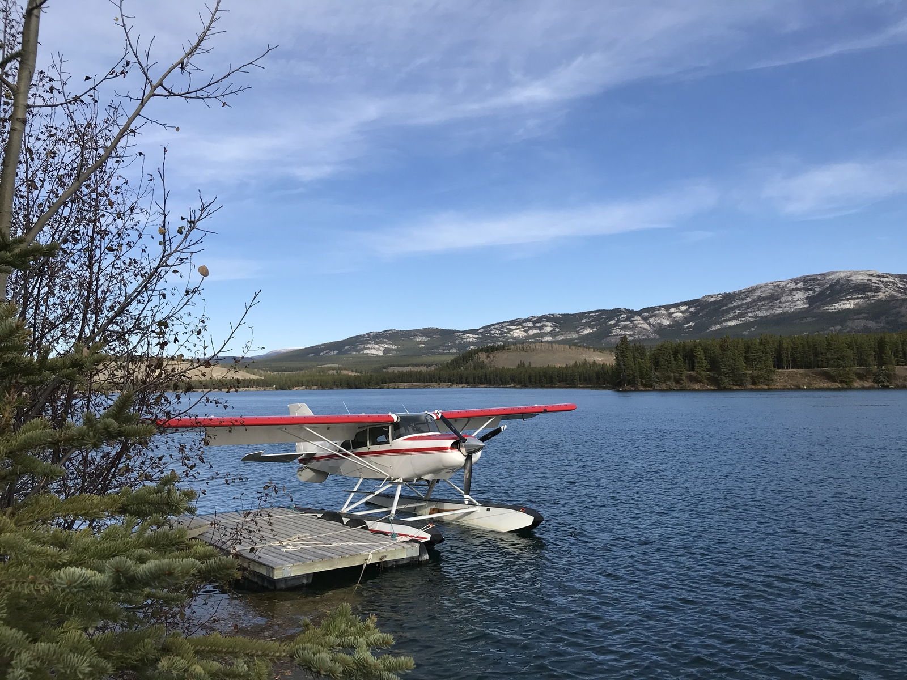
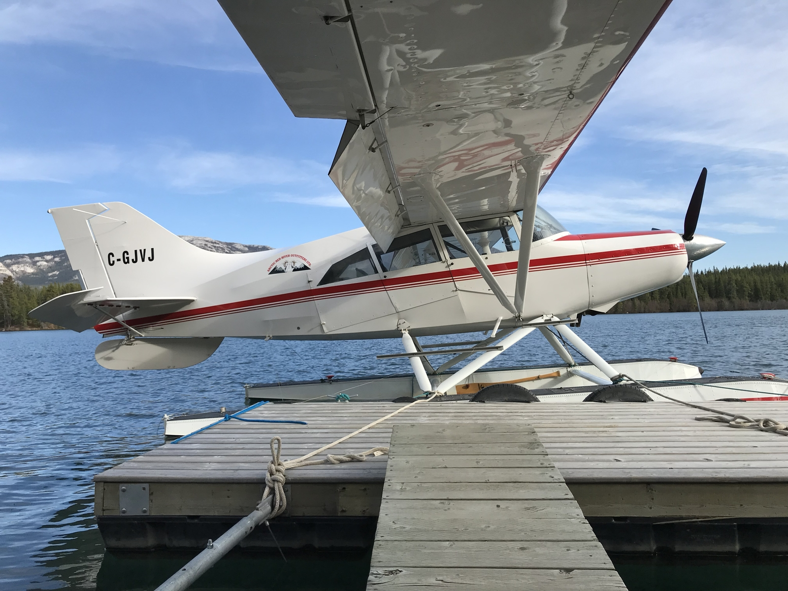

Seaplanes are a common way of transportation in Canada, the country is so huge and some places so remote that it would not be possible to access them otherwise. In lots of places, especially in Yukon they can be found parked in farm fields, or docked to a jetty right in front of the house. Pretty convenient.

Canadians use them to get around, see family or go hunting for a weekend. They are often privately owned, two to four seaters, with piston engines. But there also some airlines using bigger seaplanes (exclusively), turboprops, 6 to 19 passengers, such as <a href="https://www.harbourair.com/">Harbour Air</a>.

Cessna 182 Skylane 

An ultralight seaplane in Yukon

