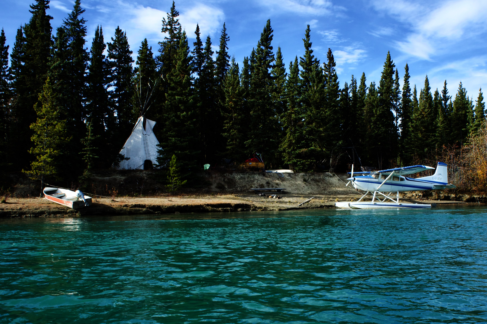

I've always dreamt of seeing the Yukon. Heart of the goldrush. Home to wolves, bears and cougars. Where a good part of the population has a seaplane in front of their house. Finally this dream came true. With the help of our HelpX host. Who welcomed us in a small but comfortable cabin in the woods. In exchange, we worked a few hours per day, building a goat fence. And learnt a lot along the way.

This is the cabin where we lived while Woofing. It is small but had heating a kitchen and huge bed. It was really cozy.

Kluane lake in Kathleen national park, near the USA border.

We stumbled upon this place while Canoëing the Yukon river from Whitehorse to our HelpX home. Not really sure what's going on here. People who live all year long in a Tipi and travel exclusively by seaplane ? Wekeend home by the river ?

Our HelpX host house.

Takhini river, near Whitehorse

Fox lake. Its emerald colors comes from clay and calcium carbonate deposits at its depths.

Unexpected northern lights over the cabin when coming back from the pub on friday night.

We've been hard at work building a new fence. This is required by Yukon governent to keep a distance of a few feet between wild and domesticated goats in order to stop the spread of a disease.

Snowplowing is serious business in Canada.

Misty morning over the Yukon river. Temperatures where already well below zero °C on the 3rd of October.

On our way back from Kluane lake.

