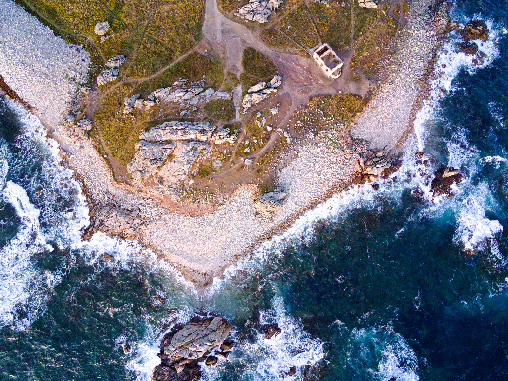
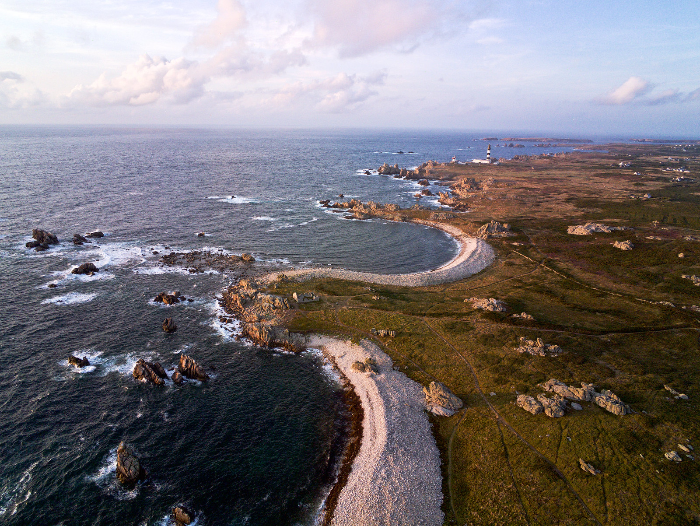
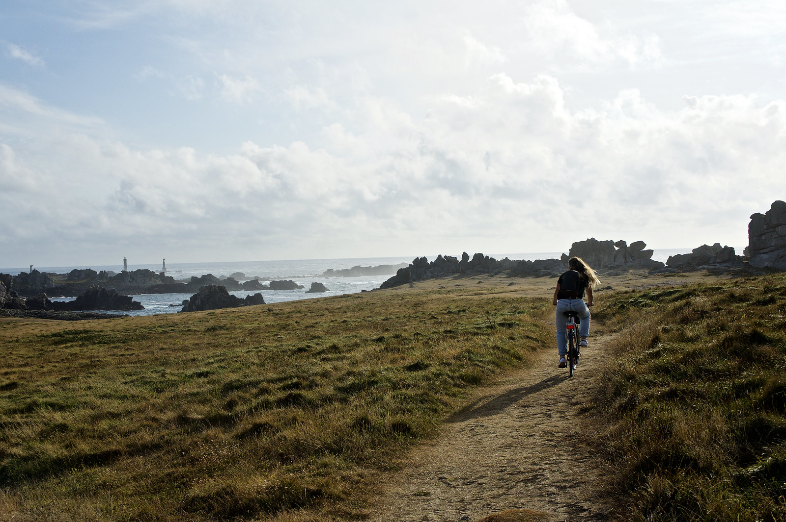
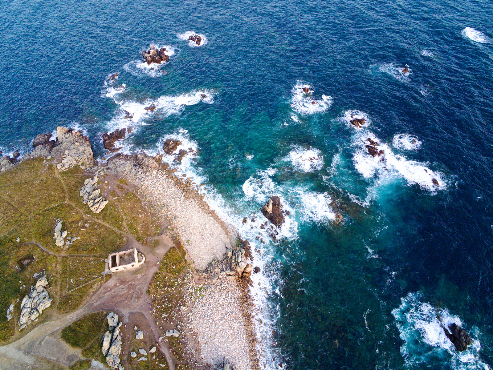
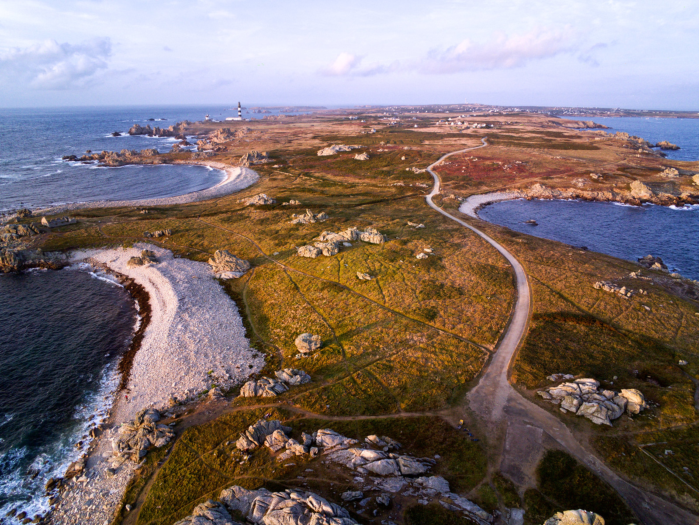
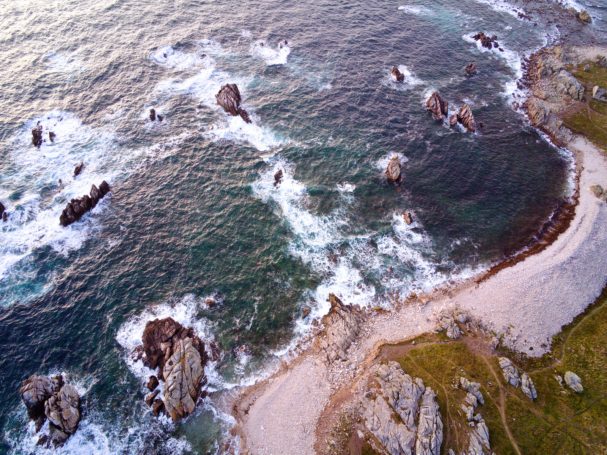

Despite haven't been born in Brittany I still have strong ties with the French region. I used to spend two weeks over there every august at my grandmother's place for the summer holydays. I still long to go back every other year. 

This time we decided to visit the westernmost place of metropolitan France. "L'île d'Ouessant". 850 inhabitants and 5 lighthouses. Among them one of the most famous of the world, the "Phare de la jument". There are camp grounds and bike rental shops. The ferry to get there is 45 minutes or so. I highly recommend visiting, even if only for a day. 

 

 

 

 

 

 

 
