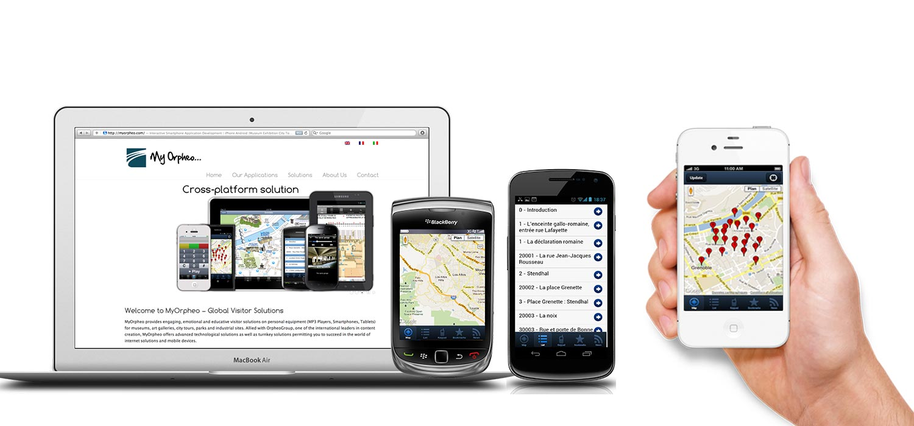
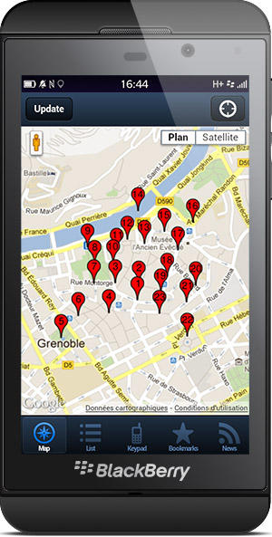

Site web de [MyOrpheo.com](http://MyOrpheo.com) le leader mondial de l'audioguide.

- Wordpress
- Photoshop
- SEO
- Analytics

Une application web / audioguide vient compléter les applications iOS et Android natives, afin de toucher toutes les plateformes (Window Phone, Blackberry, etc). Toutes les fonctions des applications natives ont pu être répliquées, mode offline, géolocalisation, parser XML.

- Sencha Touch
- Phonegap

