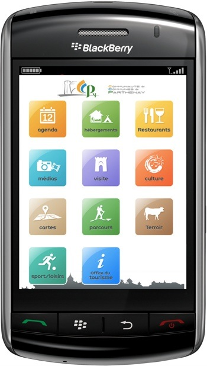

Cette application site mobile permet de visiter la communauté de communes de Parthenay grâce à n'importe quel smartphone (iPhone, Android, BlackBerry, Windows Phone, etc). Activités, restaurants, gites, campings, sites culturels, complexes sportifs, actualités, tout les renseignements nécessaires sont accessible depuis [parthenay.myorpheo.com](http://parthenay.myorpheo.com/pages/).

### Technique

L'application utilise l'API de Parthenay afin de récupérer des fichiers XML pour chaque catégories, les XML sont ensuite transformés en JSON par un proxy. A la première requête l'application enregistre les résultats à l'aide de l'API storage de HTML5 et d'un [plugin](https://github.com/paulirish/jquery-ajax-localstorage-cache) très pratique développé par Paul Irish.

Les résultats des requêtes s'affiche dans des listes à plusieurs niveaux, il à été nécessaire de créer un [plugin](https://github.com/gaelbillon/jquery-mobile---no-headers-in-nested-sublists) afin de ne pas afficher le header de jQuery mobile dans certaines sous listes.

Tout les établissements sont également accessible depuis une Google map, là ecore on récupère depuis le cache quand c'est possible, la map réajuste ses limites à chaque fois qu'on ajoute de nouveaux POIs.  

L'API facebook est intégrée à l'application et permet d'apporter un côté social à l'application en partageant un lieu, une actualité ou un événement.  

Certains outils nous on fait gagner un temps précieux, tel que [jQueryMobile](https://jquerymobile.com/) qui facilite la création d'une interface mobile orientée "Single PAge Application".  

Handlebars.js, un moteur de template qui permet de construire automatiquement le HTML de chaque page en fonction du JSON qu'on lui transmet.  

Require.js permet de ne plus se soucier de la gestion du charggement des scripts.  

CoffeScript pour réduire le code et le rendre plus élégant.  

Un script shell compile les fichiers LESS, rassemble et minimize les scripts, vérifie la syntax, puis les compresse en gzip, copie les fichiers sur le serveur, etc. On peut ainsi compiler l'application en mode production d'une simple commande.  

iScroll.js pour obtenir le "native feel" sur les longues listes.

energize.js pour rendre l'application plus réactive en supprimant le délai de 300 ms qui permet à un naviguateur mobile de savoir si il s'agit d'un clique ou d'un double clique.

