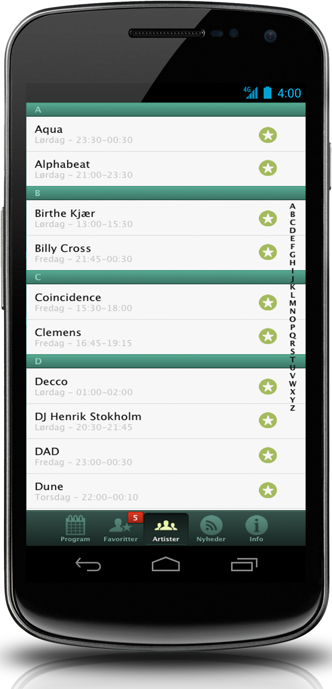
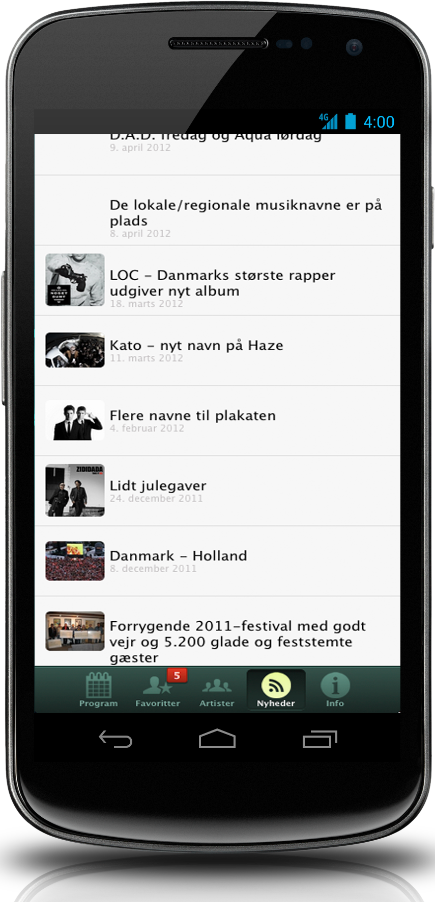
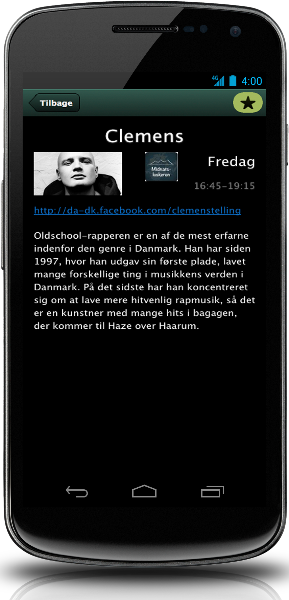
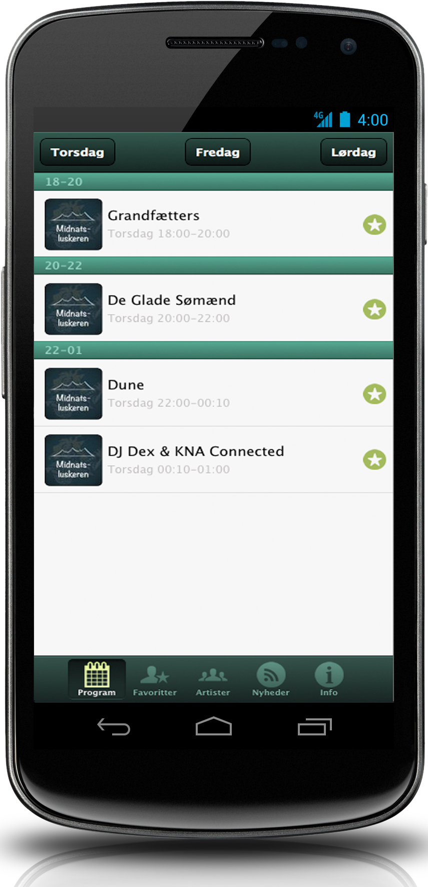

Every year, the Haze festival brings together dozens of artists and thousands of Danish spectators. The iPhone and Android application allows you to view the program, find out which band will be on which stage at which time, add artists to favorites and get detailed information about each one.

The application was developed with Sencha Architect and the Sencha Touch SDK. Sencha's framework allows you to quickly develop applications that can be adapted to any type of device (desktop, tablets, mobile) on the web or packaged as native applications with a simple command line.

Bitbucket allowed an easy collaboration with the client: sharing the latest version of the code, monitoring the progress of the project, bug tracker and wiki.

The applications were published on the AppStore and Google Play during the festival.

|  |  |  |  |
| ------------------------------------------------------------ | ------------------------------------------------------------ | ------------------------------------------------------------ | ------------------------------------------------------------ |
|                                                              |                                                              |                                                              |                                                              |

