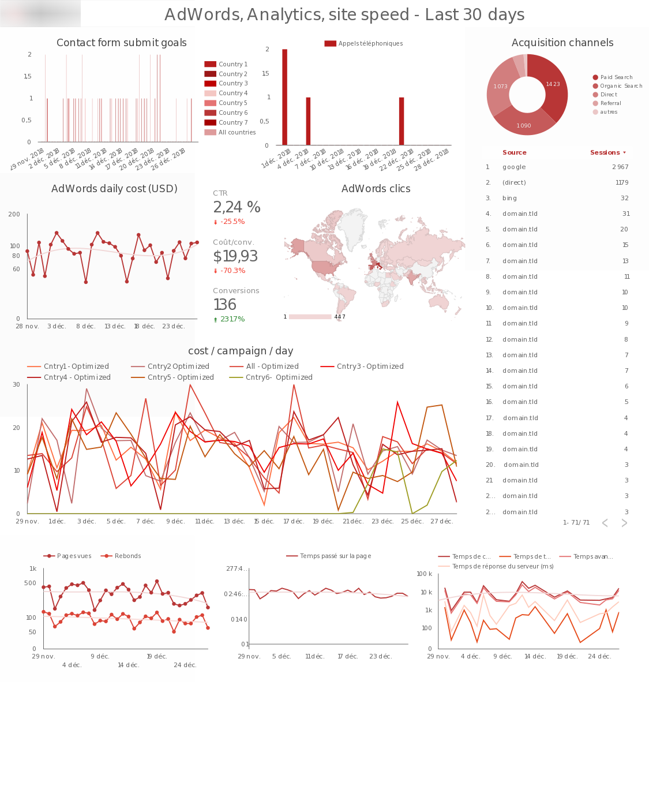

Tableau de bord de visualisation de données réalisé avec Google Data Studio affichant des données provenants de :

- Google Adwords
- Google Analytics
- Google PageSpeed Insights

Les tags sont gérés à l'aide de Google Tag Manager.

Données affichées :

Canaux d'acquisition, sources de trafic, taux de rebond, conversions, coût par conversion, emails envoyés par es formulaires de contact pour chaque pays, appels téléphoniques par pays, vitesse du site, coût par campagne Adwords par jour, etc.

